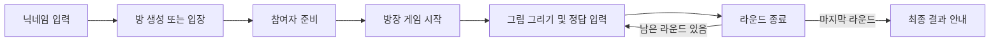
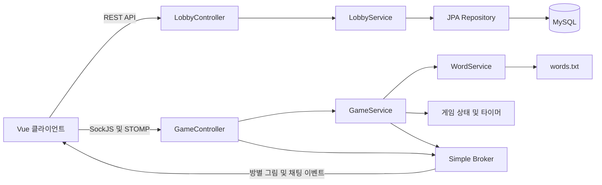

# CatchMind (실시간 멀티플레이 그림 퀴즈 게임)

> CatchMind는 출제자가 그린 그림을 보고 다른 참여자들이 채팅으로 정답을 맞히는 **실시간 멀티플레이 웹 게임**입니다. 그림, 채팅, 참여자 상태와 라운드 진행 상황을 함께 공유하며 즐길 수 있습니다.

---

## 1. 프로젝트 개요

**CatchMind**는 브라우저에서 여러 사용자가 같은 방에 접속해 그림 퀴즈를 즐길 수 있도록 구현한 프로젝트입니다. 닉네임 입력부터 방 생성, 참여자 준비, 게임 진행과 결과 안내까지 하나의 흐름으로 구성했습니다.

**Vue 기반의 프론트엔드**와 **Spring Boot 기반의 백엔드**를 연결하고, **WebSocket·STOMP**를 활용해 그림과 채팅을 실시간으로 전달합니다. 서버는 정답 판정, 점수 계산, 라운드 전환과 타이머를 관리하고, 클라이언트는 Canvas를 이용한 그림판과 게임 화면을 제공합니다.

- **서비스 형태** : 브라우저 기반 실시간 멀티플레이 게임
- **프로젝트 구성** : Vue 프론트엔드 + Spring Boot 백엔드
- **핵심 구현** : 실시간 그림 동기화, 방별 메시지 송수신, 라운드 및 참여자 상태 관리

---

## 2. 주요 기능

- **닉네임 기반 입장** : 별도의 회원가입 없이 닉네임으로 입장하고, 브라우저의 `sessionStorage`에 닉네임 저장
- **게임 로비 및 방 생성** : 방 목록과 현재 접속 인원을 1초 주기로 갱신하고, 방 제목·최대 인원·라운드 수 설정 제공
- **참여자 및 준비 상태 관리** : 방장, 참여자별 준비 여부와 점수를 표시하고, 화면에서 최소 2명 및 방장 외 참여자 전원 준비 시 게임 시작 버튼 활성화
- **실시간 그림판** : Canvas 기반 그리기, 펜 색상·굵기 변경, 지우개, 전체 지우기, 되돌리기 이벤트를 같은 방 참여자에게 전달
- **실시간 채팅 및 정답 판정** : 방별 채팅을 공유하고, 출제자를 제외한 참여자의 입력을 서버에서 제시어와 비교하여 정답자에게 10점 부여
- **라운드 및 타이머 관리** : 라운드당 180초 타이머를 공유하고, 정답·시간 초과·스킵 등으로 라운드가 종료되면 3초 뒤 다음 라운드 또는 최종 결과로 전환
- **제시어 및 출제자 관리** : 파일에서 제시어를 불러와 사용한 단어를 제외하고 선택하며, 첫 출제자는 무작위로 정하고 이후 참여자 순서로 교체
- **스킵 투표** : 닉네임별 중복 투표를 집계에서 제외하고, 출제자를 제외한 인원의 과반수에 해당하는 표가 모이면 라운드 종료
- **게임 결과 안내** : 설정된 라운드 종료 후 최고 점수를 가진 사용자 한 명을 안내하고 참여자의 준비 상태와 점수 초기화
- **퇴장 및 연결 종료 처리** : 방장 퇴장 시 권한 위임, 출제자 이탈 시 라운드 종료, 최소 인원 미달 시 게임 종료, 마지막 참여자 퇴장 시 방 삭제

### 게임 진행 흐름



방 생성 화면에서는 **최대 인원 2·4·6·8명**, **라운드 수 3·5·7·10회**를 선택할 수 있습니다.

---

## 3. 기술 스택

### Frontend

- **Framework & Build** : `Vue 3`, `Vite 8`
- **Language** : `JavaScript`, `HTML`, `CSS`
- **State Management** : Vue `reactive()` 기반 전역 상태 관리, `sessionStorage`
- **Routing & Network** : `Vue Router`, `Axios`
- **Real-time Communication** : `@stomp/stompjs`, `sockjs-client`
- **Drawing** : `HTML Canvas API`

### Backend

- **Language & Framework** : `Java 26`, `Spring Boot 4.1.0`
- **Web & Messaging** : `Spring Web`, `Spring WebSocket`, `STOMP`, `SockJS`
- **Message Broker** : Spring 내장 `Simple Broker`
- **Database & ORM** : `MySQL`, `Spring Data JPA`, `Hibernate`
- **Scheduling** : `ScheduledExecutorService`
- **Library & Build** : `Lombok`, `Gradle Wrapper 9.6.1`

---

## 4. 시스템 아키텍처 및 실시간 통신

닉네임 등록과 방 생성·조회는 **REST API**로 처리하고, 게임 중 발생하는 그림·채팅·상태 변경은 **SockJS와 STOMP 기반 통신**으로 전달합니다. 방 ID별로 구독 경로를 나누어 각 방의 참여자에게 메시지를 전달합니다.



### 실시간 그림 동기화

출제자의 마우스 이동을 Canvas에 즉시 반영하고, 선의 시작·종료 좌표와 색상·굵기를 서버로 전송합니다. 전송 간격을 약 **30ms로 제한**하며, 서버는 같은 방의 그림 채널 구독자에게 메시지를 전달합니다.

클라이언트는 자신의 닉네임으로 보낸 메시지를 제외하고 수신한 그림을 그립니다. 전체 지우기와 되돌리기도 이벤트로 전달하며, 되돌리기는 각 클라이언트가 보관하는 **최대 20개의 Canvas 상태**를 사용합니다.

### 서버 중심의 게임 진행

`GameService`가 방별 정답, 출제자, 점수, 투표와 라운드를 관리합니다. `ScheduledExecutorService`로 남은 시간을 1초마다 전달하고, 라운드가 끝나면 다음 진행을 예약합니다.

`WebSocketEventListener`는 연결 종료를 감지해 해당 사용자를 퇴장 처리합니다. 방에 남은 인원과 출제자 여부에 따라 방장 위임, 게임 종료 또는 방 삭제를 수행합니다.

### 통신 경로

| 구분 | 경로 | 역할 |
| --- | --- | --- |
| REST | `POST /api/lobby/player` | 닉네임 등록 및 기존 사용자 조회 |
| REST | `POST /api/lobby/room` | 게임방 생성 |
| REST | `GET /api/lobby/rooms` | 방 목록과 현재 인원 조회 |
| SockJS | `/ws-game` | 실시간 연결 엔드포인트 |
| STOMP 발행 | `/app/room/{roomId}/{action}` | 게임 동작 요청 |
| STOMP 구독 | `/topic/room/{roomId}/draw` | 그림 이벤트 수신 |
| STOMP 구독 | `/topic/room/{roomId}/chat` | 채팅·참여자·라운드·타이머 수신 |

게임 동작 요청의 `action`은 `enter`, `leave`, `ready`, `start`, `chat`, `skip`, `draw`로 구성됩니다.

### 데이터 관리

- **MySQL** : 사용자 닉네임과 방 제목·최대 인원·설정 라운드 등 방 메타데이터 저장
- **서버 메모리** : 실제 접속자, 정답, 점수, 투표, 진행 라운드와 타이머 관리
- **브라우저** : 닉네임, 화면 상태, Canvas와 되돌리기 이력 관리

현재는 단일 서버에서 게임 상태를 관리하며, 서버 시작 시 기존 사용자와 방 데이터를 초기화합니다. 게임 기록의 영구 저장은 구현되어 있지 않습니다.

---

## 5. 폴더 구조

프론트엔드와 백엔드는 별도 프로젝트로 구성되어 있으며, 이 문서는 두 프로젝트를 함께 설명합니다.

<details>
<summary><b>Frontend (catchmind-front) 구조 보기</b></summary>

```text
├── src/
│   ├── components/
│   │   ├── CanvasBoard.vue     # 그림판·도구·라운드·타이머 표시
│   │   ├── ChatWindow.vue      # 채팅·게임 이벤트·스킵 투표
│   │   └── PlayerList.vue      # 참여자·점수·준비·게임 시작
│   ├── router/
│   │   └── index.js            # 로그인·로비·게임방 라우팅
│   ├── services/
│   │   └── stompClient.js      # STOMP 연결·발행·구독
│   ├── views/
│   │   ├── LoginView.vue       # 닉네임 입력 및 입장
│   │   ├── LobbyView.vue       # 방 목록 및 생성 모달
│   │   └── RoomView.vue        # 게임방 화면 구성 및 퇴장
│   ├── store.js               # Vue 반응형 전역 상태
│   ├── App.vue                # 라우터 화면 및 공통 스타일
│   └── main.js                # 애플리케이션 진입점
├── index.html
├── package.json               # 의존성 및 실행 스크립트
├── package-lock.json          # 의존성 버전 고정
└── vite.config.js             # Vue 플러그인 및 경로 별칭 설정
```

</details>

<details>
<summary><b>Backend (catchmind-back) 구조 보기</b></summary>

```text
├── src/main/
│   ├── java/com/catchmindback/
│   │   ├── config/
│   │   │   ├── WebSocketConfig.java         # STOMP·SockJS·브로커 설정
│   │   │   └── WebSocketEventListener.java  # 연결 종료 및 퇴장 처리
│   │   ├── controller/
│   │   │   ├── LobbyController.java         # 닉네임·방 REST API
│   │   │   └── GameController.java          # 게임 STOMP 메시지 처리
│   │   ├── dto/                            # 채팅·그림·참여자 데이터 모델
│   │   ├── entity/
│   │   │   ├── Player.java                  # 사용자 엔티티
│   │   │   └── GameRoom.java                # 게임방 엔티티
│   │   ├── repository/                     # Spring Data JPA Repository
│   │   ├── service/
│   │   │   ├── LobbyService.java            # 닉네임·방 관리 및 초기화
│   │   │   ├── GameService.java             # 라운드·정답·점수·투표·타이머
│   │   │   └── WordService.java             # 제시어 파일 로딩
│   │   └── CatchmindBackApplication.java    # 서버 진입점
│   └── resources/
│       ├── application.yaml                 # 서버·DB·JPA 설정
│       └── words.txt                        # 제시어 목록
├── gradle/wrapper/                          # Gradle Wrapper
├── gradlew
├── gradlew.bat
├── settings.gradle
└── build.gradle                            # 의존성 및 Java 빌드 설정
```

</details># CatchMind (실시간 멀티플레이 그림 퀴즈 게임)

> CatchMind는 출제자가 그린 그림을 보고 다른 참여자들이 채팅으로 정답을 맞히는 **실시간 멀티플레이 웹 게임**입니다. 그림, 채팅, 참여자 상태와 라운드 진행 상황을 함께 공유하며 즐길 수 있습니다.

---

## 1. 프로젝트 개요

**CatchMind**는 브라우저에서 여러 사용자가 같은 방에 접속해 그림 퀴즈를 즐길 수 있도록 구현한 프로젝트입니다. 닉네임 입력부터 방 생성, 참여자 준비, 게임 진행과 결과 안내까지 하나의 흐름으로 구성했습니다.

**Vue 기반의 프론트엔드**와 **Spring Boot 기반의 백엔드**를 연결하고, **WebSocket·STOMP**를 활용해 그림과 채팅을 실시간으로 전달합니다. 서버는 정답 판정, 점수 계산, 라운드 전환과 타이머를 관리하고, 클라이언트는 Canvas를 이용한 그림판과 게임 화면을 제공합니다.

- **서비스 형태** : 브라우저 기반 실시간 멀티플레이 게임
- **프로젝트 구성** : Vue 프론트엔드 + Spring Boot 백엔드
- **핵심 구현** : 실시간 그림 동기화, 방별 메시지 송수신, 라운드 및 참여자 상태 관리

---

## 2. 주요 기능

- **닉네임 기반 입장** : 별도의 회원가입 없이 닉네임으로 입장하고, 브라우저의 `sessionStorage`에 닉네임 저장
- **게임 로비 및 방 생성** : 방 목록과 현재 접속 인원을 1초 주기로 갱신하고, 방 제목·최대 인원·라운드 수 설정 제공
- **참여자 및 준비 상태 관리** : 방장, 참여자별 준비 여부와 점수를 표시하고, 화면에서 최소 2명 및 방장 외 참여자 전원 준비 시 게임 시작 버튼 활성화
- **실시간 그림판** : Canvas 기반 그리기, 펜 색상·굵기 변경, 지우개, 전체 지우기, 되돌리기 이벤트를 같은 방 참여자에게 전달
- **실시간 채팅 및 정답 판정** : 방별 채팅을 공유하고, 출제자를 제외한 참여자의 입력을 서버에서 제시어와 비교하여 정답자에게 10점 부여
- **라운드 및 타이머 관리** : 라운드당 180초 타이머를 공유하고, 정답·시간 초과·스킵 등으로 라운드가 종료되면 3초 뒤 다음 라운드 또는 최종 결과로 전환
- **제시어 및 출제자 관리** : 파일에서 제시어를 불러와 사용한 단어를 제외하고 선택하며, 첫 출제자는 무작위로 정하고 이후 참여자 순서로 교체
- **스킵 투표** : 닉네임별 중복 투표를 집계에서 제외하고, 출제자를 제외한 인원의 과반수에 해당하는 표가 모이면 라운드 종료
- **게임 결과 안내** : 설정된 라운드 종료 후 최고 점수를 가진 사용자 한 명을 안내하고 참여자의 준비 상태와 점수 초기화
- **퇴장 및 연결 종료 처리** : 방장 퇴장 시 권한 위임, 출제자 이탈 시 라운드 종료, 최소 인원 미달 시 게임 종료, 마지막 참여자 퇴장 시 방 삭제

### 게임 진행 흐름


방 생성 화면에서는 **최대 인원 2·4·6·8명**, **라운드 수 3·5·7·10회**를 선택할 수 있습니다.

---

## 3. 기술 스택

### Frontend

- **Framework & Build** : `Vue 3`, `Vite 8`
- **Language** : `JavaScript`, `HTML`, `CSS`
- **State Management** : Vue `reactive()` 기반 전역 상태 관리, `sessionStorage`
- **Routing & Network** : `Vue Router`, `Axios`
- **Real-time Communication** : `@stomp/stompjs`, `sockjs-client`
- **Drawing** : `HTML Canvas API`

### Backend

- **Language & Framework** : `Java 26`, `Spring Boot 4.1.0`
- **Web & Messaging** : `Spring Web`, `Spring WebSocket`, `STOMP`, `SockJS`
- **Message Broker** : Spring 내장 `Simple Broker`
- **Database & ORM** : `MySQL`, `Spring Data JPA`, `Hibernate`
- **Scheduling** : `ScheduledExecutorService`
- **Library & Build** : `Lombok`, `Gradle Wrapper 9.6.1`

---

## 4. 시스템 아키텍처 및 실시간 통신

닉네임 등록과 방 생성·조회는 **REST API**로 처리하고, 게임 중 발생하는 그림·채팅·상태 변경은 **SockJS와 STOMP 기반 통신**으로 전달합니다. 방 ID별로 구독 경로를 나누어 각 방의 참여자에게 메시지를 전달합니다.


### 실시간 그림 동기화

출제자의 마우스 이동을 Canvas에 즉시 반영하고, 선의 시작·종료 좌표와 색상·굵기를 서버로 전송합니다. 전송 간격을 약 **30ms로 제한**하며, 서버는 같은 방의 그림 채널 구독자에게 메시지를 전달합니다.

클라이언트는 자신의 닉네임으로 보낸 메시지를 제외하고 수신한 그림을 그립니다. 전체 지우기와 되돌리기도 이벤트로 전달하며, 되돌리기는 각 클라이언트가 보관하는 **최대 20개의 Canvas 상태**를 사용합니다.

### 서버 중심의 게임 진행

`GameService`가 방별 정답, 출제자, 점수, 투표와 라운드를 관리합니다. `ScheduledExecutorService`로 남은 시간을 1초마다 전달하고, 라운드가 끝나면 다음 진행을 예약합니다.

`WebSocketEventListener`는 연결 종료를 감지해 해당 사용자를 퇴장 처리합니다. 방에 남은 인원과 출제자 여부에 따라 방장 위임, 게임 종료 또는 방 삭제를 수행합니다.

### 통신 경로

| 구분 | 경로 | 역할 |
| --- | --- | --- |
| REST | `POST /api/lobby/player` | 닉네임 등록 및 기존 사용자 조회 |
| REST | `POST /api/lobby/room` | 게임방 생성 |
| REST | `GET /api/lobby/rooms` | 방 목록과 현재 인원 조회 |
| SockJS | `/ws-game` | 실시간 연결 엔드포인트 |
| STOMP 발행 | `/app/room/{roomId}/{action}` | 게임 동작 요청 |
| STOMP 구독 | `/topic/room/{roomId}/draw` | 그림 이벤트 수신 |
| STOMP 구독 | `/topic/room/{roomId}/chat` | 채팅·참여자·라운드·타이머 수신 |

게임 동작 요청의 `action`은 `enter`, `leave`, `ready`, `start`, `chat`, `skip`, `draw`로 구성됩니다.

### 데이터 관리

- **MySQL** : 사용자 닉네임과 방 제목·최대 인원·설정 라운드 등 방 메타데이터 저장
- **서버 메모리** : 실제 접속자, 정답, 점수, 투표, 진행 라운드와 타이머 관리
- **브라우저** : 닉네임, 화면 상태, Canvas와 되돌리기 이력 관리

현재는 단일 서버에서 게임 상태를 관리하며, 서버 시작 시 기존 사용자와 방 데이터를 초기화합니다. 게임 기록의 영구 저장은 구현되어 있지 않습니다.

---

## 5. 폴더 구조

프론트엔드와 백엔드는 별도 프로젝트로 구성되어 있으며, 이 문서는 두 프로젝트를 함께 설명합니다.

<details>
<summary><b>Frontend (catchmind-front) 구조 보기</b></summary>

```text
├── src/
│   ├── components/
│   │   ├── CanvasBoard.vue     # 그림판·도구·라운드·타이머 표시
│   │   ├── ChatWindow.vue      # 채팅·게임 이벤트·스킵 투표
│   │   └── PlayerList.vue      # 참여자·점수·준비·게임 시작
│   ├── router/
│   │   └── index.js            # 로그인·로비·게임방 라우팅
│   ├── services/
│   │   └── stompClient.js      # STOMP 연결·발행·구독
│   ├── views/
│   │   ├── LoginView.vue       # 닉네임 입력 및 입장
│   │   ├── LobbyView.vue       # 방 목록 및 생성 모달
│   │   └── RoomView.vue        # 게임방 화면 구성 및 퇴장
│   ├── store.js               # Vue 반응형 전역 상태
│   ├── App.vue                # 라우터 화면 및 공통 스타일
│   └── main.js                # 애플리케이션 진입점
├── index.html
├── package.json               # 의존성 및 실행 스크립트
├── package-lock.json          # 의존성 버전 고정
└── vite.config.js             # Vue 플러그인 및 경로 별칭 설정
```

</details>

<details>
<summary><b>Backend (catchmind-back) 구조 보기</b></summary>

```text
├── src/main/
│   ├── java/com/catchmindback/
│   │   ├── config/
│   │   │   ├── WebSocketConfig.java         # STOMP·SockJS·브로커 설정
│   │   │   └── WebSocketEventListener.java  # 연결 종료 및 퇴장 처리
│   │   ├── controller/
│   │   │   ├── LobbyController.java         # 닉네임·방 REST API
│   │   │   └── GameController.java          # 게임 STOMP 메시지 처리
│   │   ├── dto/                            # 채팅·그림·참여자 데이터 모델
│   │   ├── entity/
│   │   │   ├── Player.java                  # 사용자 엔티티
│   │   │   └── GameRoom.java                # 게임방 엔티티
│   │   ├── repository/                     # Spring Data JPA Repository
│   │   ├── service/
│   │   │   ├── LobbyService.java            # 닉네임·방 관리 및 초기화
│   │   │   ├── GameService.java             # 라운드·정답·점수·투표·타이머
│   │   │   └── WordService.java             # 제시어 파일 로딩
│   │   └── CatchmindBackApplication.java    # 서버 진입점
│   └── resources/
│       ├── application.yaml                 # 서버·DB·JPA 설정
│       └── words.txt                        # 제시어 목록
├── gradle/wrapper/                          # Gradle Wrapper
├── gradlew
├── gradlew.bat
├── settings.gradle
└── build.gradle                            # 의존성 및 Java 빌드 설정
```

</details>
